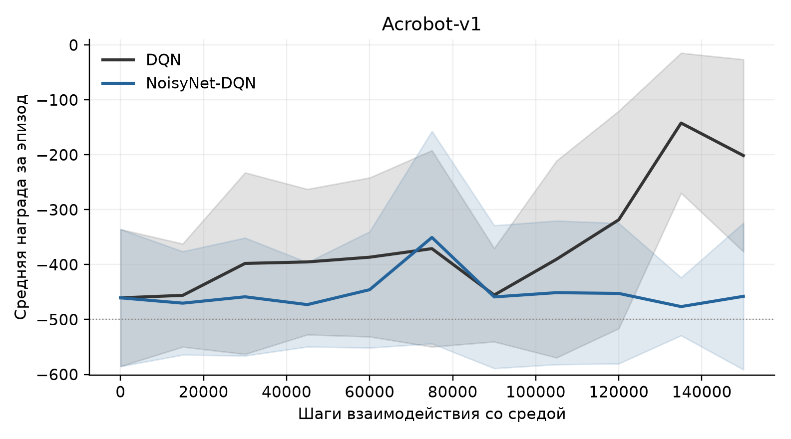

# NoisyNets в обучении с подкреплением

Курсовая работа по МГМО. Автор: Горбунов Иван Олегович, ИУ6-74б. Руководитель: Кудрявцев Сергей Александрович.

Тема: «Применение нейронных сетей с параметрическим шумом (NoisyNets) в задачах обучения с подкреплением».

[Итоговая РПЗ](reports/РПЗ_Горбунов_МГМО_NoisyNets_итоговая.docx) · [Повторная серия CartPole](notebooks/04_cartpole.ipynb) · [Исходная серия A3C/PPO](notebooks/03_all_models.ipynb) · [Исходная серия DQN](notebooks/02_final_study.ipynb)

Реализованы и объяснены DQN, A3C, PPO и их шумовые варианты. Проверены независимый и факторизованный гауссовский шум, динамика σ, скорость достижения порога и стабильность. Выполнены 200 обучений в исходных сериях и 100 обучений в повторных сериях CartPole. Сохранены модели, настройки и оценки.

[Соответствие индивидуальному заданию](REQUIREMENTS.md)

## Повторная серия CartPole

В исходной серии из 120 обучений A3C/PPO 60 приходились на CartPole. Ни одна из 60 моделей не достигла порога 475 в основном стохастическом режиме. У DQN один запуск достиг 500 на промежуточной оценке и потерял качество к концу обучения. В повторной серии отдельно проверяются первое достижение порога и средний возврат последней модели.

Настройка использует seed 300–303. Подтверждающий эксперимент использует seed обучения 400–409, валидацию на стартах 75 000–75 009 и отложенную оценку на 85 000–85 029. Порог 475 применяется к среднему из 30 отложенных эпизодов каждой модели. В таблицах показаны все десять моделей из каждого условия.

В DQN мягко обновляется целевая сеть, снижается темп обучения и используется тренировочная награда Sutton–Barto. Она даёт −1 за истинное завершение и 0 на остальных шагах. Для оценки сохранена награда +1 за шаг. В A3C повышен начальный темп обучения и увеличен бюджет. Повторный PPO использует раздельные сети политики и ценности, ортогональную инициализацию и снижение темпа обучения. Сравнение с исходной серией отражает изменение протокола в целом.

| Модель | Средний итоговый возврат ± SD | Моделей с возвратом ≥475 из 10 |
|---|---:|---:|
| DQN | 463,17 ± 116,46 | 9 |
| Noisy-DQN | 484,57 ± 48,80 | 9 |
| A3C | 500,00 ± 0,00 | 10 |
| Noisy-A3C, фактор. | 497,10 ± 6,14 | 10 |
| Noisy-A3C, незав. | 498,78 ± 2,74 | 10 |
| PPO | 500,00 ± 0,00 | 10 |
| Noisy-PPO, фактор. | 500,00 ± 0,00 | 10 |
| Noisy-PPO, незав. | 500,00 ± 0,00 | 10 |

В отдельной проверке остановки по валидации DQN получил 498,75, Noisy-DQN с шумом — 499,20. Правило использует две последовательные оценки ≥475 и для Noisy-DQN требует выполнения условия в обоих режимах. Проверены новые seed обучения 410–419 и отложенные старты 86 000–86 029. Итоговый порог пройден во всех требуемых режимах у 20 из 20 моделей. [Сводка эксперимента](results/cartpole_dqn_stopping/analysis/summary.json)

Повторная оценка всех 100 сохранённых моделей CartPole совпала с журналами на 6 900 эпизодах. [Проверка фиксированной серии](results/cartpole_analysis/checkpoint_verification.csv) · [Проверка серии с остановкой](results/cartpole_dqn_stopping/analysis/verification.csv)

Сводные результаты доступны в [ноутбуке CartPole](notebooks/04_cartpole.ipynb) и [таблице по запускам](results/cartpole_analysis/runs.csv). Результаты подбора, включая слабые настройки, сохранены в [tuning.csv](results/cartpole_analysis/tuning.csv).

```bash
python scripts/analyze_cartpole.py
python scripts/verify_cartpole.py --workers 2
python scripts/analyze_cartpole_stopping.py --verify
python scripts/execute_notebook.py notebooks/04_cartpole.ipynb
```

Новые обучения запускаются по зафиксированным манифестам. Выходной каталог задаётся отдельно, чтобы сохранить опубликованные веса:

```bash
python scripts/run_final_study.py --manifest "$PWD/configs/cartpole_dqn_final.json" --out "$PWD/results/reproduced-cartpole-dqn"
python scripts/cartpole_a3c_batch.py --out "$PWD/results/reproduced-cartpole-a3c"
python scripts/cartpole_ppo_final.py --out "$PWD/results/reproduced-cartpole-ppo"
python scripts/run_final_study.py --manifest "$PWD/configs/cartpole_dqn_stopping.json" --out "$PWD/results/reproduced-cartpole-stopping"
```

## Исходная серия A3C и PPO

A3C использует четыре конкурентных actor-learner с собственными средами и локальными сетями. Градиенты применяются асинхронно; атомарны копирование параметров и Adam. Барьер между всеми потоками используется только на контрольных оценках. Это A3C, а не синхронный A2C. В журналах сохранено запаздывание градиентов. Порядок потоков ограничивает побитовую повторяемость обучения.

Noisy-A3C сохраняет ε на один rollout. Noisy-PPO сохраняет одну реализацию ε от сбора rollout до конца всех эпох: отношение вероятностей условно на том же ε. Перед оптимизацией проверяется log-ratio≈0. В обоих шумовых actor-critic удалён entropy bonus, sampling действий сохранён. Noisy-PPO — явно описанная интеграция для курсовой, не алгоритм из оригинальной статьи NoisyNets.

Новая серия: по десять seed 200–209; CartPole — 100 000, Acrobot — 150 000 шагов; четыре среды; n-step до 20 у A3C, rollout до 128 и четыре эпохи у PPO; σ₀ = 0,1. Оба генератора проверены внутри каждого семейства. Валидация использует seed 55 000–55 009, отложенные старты — 65 000–65 029. Первичный режим — стохастическое поведение с шумом у NoisyNet; mean-greedy и mean-sampled показываются отдельно.

| Среда | Модель | Возврат поведения, среднее ± SD | AUC |
|---|---|---:|---:|
| acrobot | A3C | −498,69 ± 1,70 | −494,14 |
| acrobot | Noisy-A3C факторизованный | −496,72 ± 3,96 | −497,29 |
| acrobot | Noisy-A3C независимый | −495,80 ± 6,22 | −495,41 |
| acrobot | Noisy-PPO факторизованный | −378,04 ± 196,38 | −440,25 |
| acrobot | Noisy-PPO независимый | −459,17 ± 129,12 | −478,30 |
| acrobot | PPO | −168,60 ± 154,88 | −368,23 |
| cartpole | A3C | 49,61 ± 8,54 | 34,66 |
| cartpole | Noisy-A3C факторизованный | 49,17 ± 4,11 | 38,25 |
| cartpole | Noisy-A3C независимый | 48,10 ± 6,94 | 38,36 |
| cartpole | Noisy-PPO факторизованный | 107,98 ± 46,48 | 90,42 |
| cartpole | Noisy-PPO независимый | 140,39 ± 43,73 | 85,68 |
| cartpole | PPO | 146,07 ± 32,56 | 91,29 |

Показатели рассчитаны по десяти средним моделей, каждая оценена на 30 эпизодах. Все описательные парные интервалы, сравнения генераторов и режимов доступны в [сводке](results/policy_analysis/summary.json). Поправка на множественные сравнения не применяется. Модели не отбирались по награде.

Скорость описывается AUC и первым достижением заранее заданного валидационного порога: 475 на CartPole, −100 на Acrobot. Недостижение учитывается как цензурирование; медиана среди достигших показывается вместе с их числом. SD между seed и колебания последних пяти оценок характеризуют разные стороны стабильности. Достижение порога не является доказательством сходимости.

## Исходные результаты DQN

Основные показатели рассчитаны из всех 80 завершённых запусков. В таблице приведены среднее ± выборочное SD по десяти seed обучения. Каждое наблюдение — средний возврат одной модели на 30 отложенных эпизодах.

| Среда | Метод | Итоговый возврат | AUC / бюджет |
|---|---|---:|---:|
| CartPole-v1 | DQN | 139,88 ± 51,07 | 182,82 ± 29,77 |
| CartPole-v1 | NoisyNet-DQN | 131,14 ± 80,04 | 139,42 ± 26,02 |
| Acrobot-v1 | DQN | −186,70 ± 168,24 | −364,35 ± 60,40 |
| Acrobot-v1 | NoisyNet-DQN | −459,27 ± 128,79 | −449,60 ± 48,77 |

В основном протоколе улучшение не подтвердилось. На CartPole разность итоговых возвратов NoisyNet − DQN равна −8,75, парный 95%-й интервал [−61,87; 39,51]; разность AUC — −43,40 [−63,54; −27,80]. На Acrobot разность итоговых возвратов — −272,57 [−400,07; −101,45], AUC — −85,25 [−133,83; −37,04]. Больший, то есть менее отрицательный, возврат Acrobot лучше.

Основная оценка: жадное действие DQN и средние веса μ у NoisyNet. Дополнительно каждая шумовая модель оценивается с пересэмплированием шума перед каждым действием. Эти режимы задают разные политики; выход сети по средним весам не является математическим усреднением стохастической политики.

На Acrobot режим оценки существенно меняет результат: основная NoisyNet получает −459,27 ± 128,79 по μ и −195,66 ± 57,72 с шумом. Девять из десяти политик по μ не достигают цели ни в одном из 30 эпизодов. Это не означает, что соответствующие стохастические политики не обучились: средняя разность двух режимов составляет +263,61 [195,78; 313,96]. На CartPole оценки ближе: 131,14 по μ и 129,70 с шумом. Отключение шума является отдельным экспериментальным выбором, а не заявленным воспроизведением протокола исходной статьи.

После просмотра серии дополнительно сопоставлены NoisyNet с включённым шумом и жадный DQN. Разность на Acrobot составляет −8,96 [−117,78; 122,27], на CartPole — −10,19 [−61,82; 36,92]. Это отдельный исследовательский анализ: оба интервала включают ноль и не доказывают эквивалентности политик. Подробности сохранены в [stochastic_comparisons.csv](results/final_analysis/stochastic_comparisons.csv).

Абляции на Acrobot, основная оценка по μ:

| Условие | Итоговый возврат, среднее ± SD | AUC / бюджет | Достижение цели |
|---|---:|---:|---:|
| Обучаемый σ, σ₀ = 0,5 | −459,27 ± 128,79 | −449,60 | 10,0 % |
| Обучаемый σ, σ₀ = 0,1 | −428,95 ± 133,61 | −439,89 | 18,3 % |
| Обучаемый σ, σ₀ = 1,0 | −405,00 ± 164,87 | −453,70 | 24,0 % |
| Фиксированный σ, σ₀ = 0,5 | −500,00 ± 0,00 | −491,50 | 0,0 % |
| Шум между обновлениями | −431,75 ± 145,94 | −421,43 | 17,3 % |

Интервалы разностей итогового возврата каждой абляции относительно основной NoisyNet включают ноль. У фиксированного σ все политики по μ получают −500; его AUC ниже основной NoisyNet на 41,90 [−68,07; −17,48]. Эти результаты не устанавливают универсально лучший масштаб или частоту шума. Полные показатели, интервалы и результаты стохастической оценки доступны в [summary.json](results/final_analysis/summary.json) и [ноутбуке](notebooks/02_final_study.ipynb).




Линии показывают средние оценки десяти моделей, заливка — ± одно выборочное стандартное отклонение между обучениями. Итоговые показатели относятся к последнему чекпойнту; лучший момент на кривой не выбирался. Нормированная AUC — площадь под кривой оценки, делённая на бюджет шагов. Она выражена в единицах возврата; значения двух сред между собой не усредняются.

Разности сопоставляются попарно по seed с общей начальной инициализацией μ. Используются 20 000 bootstrap-перевыборок пар и процентильные 95%-е интервалы. Все интервалы описательные, без поправки на множественные сравнения. Интервал, содержащий ноль, не доказывает равенства методов.

## Исходный протокол DQN

| Параметр | CartPole-v1 | Acrobot-v1 |
|---|---:|---:|
| Условия | DQN, NoisyNet | DQN, NoisyNet и 4 абляции |
| Seed обучения | 100–109 | 100–109 |
| Шагов на обучение | 100 000 | 150 000 |
| Всего обучений | 20 | 60 |
| Топология с ReLU | 4 → 64 → 64 → 2 | 6 → 128 → 128 → 3 |
| Снижение ε: 1 → 0,05 | 50 000 шагов | 75 000 шагов |
| Интервал оценки | 10 000 шагов | 15 000 шагов |

Общие настройки: Adam с шагом 0,0003; γ = 0,99; Huber loss; uniform replay на 100 000 переходов; minibatch 64. Первое градиентное обновление выполняется на шаге 2000, следующие — каждые четыре шага среды. Target копируется каждые 1000 шагов среды. Норма градиента ограничена значением 10. Double DQN, dueling, prioritized replay и многошаговые цели не используются.

В NoisyNet два последних линейных слоя шумовые, первый — обычный. Параметры слоя: μ + σ ⊙ ε; факторизация использует `sign(x) * sqrt(abs(x))`. Начальный масштаб весов равен σ₀/√p, смещений — σ₀/√q; основное σ₀ = 0,5. Внутри minibatch шум фиксирован, для основной и целевой сетей генерируются независимые реализации. В поведении нет ε-жадного выбора.

Абляции на Acrobot меняют по одному компоненту относительно основной NoisyNet: σ₀ = 0,1; σ₀ = 1,0; фиксированный σ при σ₀ = 0,5; шум поведения, сохраняемый между обновлениями. В основном режиме шум меняется перед каждым действием. В варианте `update` после разминки он пересэмплируется после шага оптимизатора и сохраняется до следующего обновления. Во время общей разминки шум меняется перед каждым действием в обоих режимах.

Число обучаемых параметров DQN / NoisyNet составляет 4610 / 8900 на CartPole и 17 795 / 34 694 на Acrobot. В `noisy-fixed` коэффициенты σ хранятся в модели, но не оптимизируются. Этот контроль проверяет влияние обучения масштаба; одинаковая топология не означает одинаковых вычислительных затрат.

Начальная и десять промежуточных оценок используют по 10 эпизодов с seed среды 30 000–30 009. Итоговая оценка использует 30 эпизодов с seed 40 000–40 029, которые не применяются для выбора настройки или чекпойнта. Оценка выполняется на копии модели в отдельной среде с восстановлением RNG PyTorch. Только `terminated` выключает bootstrap; `truncated` вызывает reset, но сохраняет будущую ценность в TD-цели.

## Воспроизведение

Проверенное окружение: Python 3.12.14, PyTorch 2.15.0, Gymnasium 1.4.0, CPU, один поток PyTorch на процесс. Совпадение результатов между разными платформами и версиями библиотек не гарантируется.

```bash
git clone https://github.com/hixday28/noisynets-rl.git
cd noisynets-rl
python3.12 -m venv .venv
source .venv/bin/activate
python -m pip install -r requirements-lock.txt
python -m pip install --no-deps -e .
python -m pytest -q
```

Повторно построить таблицы и графики из опубликованных журналов:

```bash
python -m noisynets.final_analysis --results results/final --out results/final_analysis --manifest configs/final_study.json
python -m noisynets.policy_analysis
```

Ноутбук исходной серии A3C/PPO повторно оценивает 120 сохранённых моделей на 9600 эпизодах. Ноутбук DQN проверяет 80 моделей и 4200 эпизодов. Все награды, длины и признаки завершения совпали.

```bash
python scripts/execute_notebook.py notebooks/03_all_models.ipynb
```

Для интерактивного открытия подходит VS Code или отдельно установленный JupyterLab. Повторная оценка моделей и повторное обучение — разные проверки: выполнение ноутбука не обучает заново все модели.

Запустить всю серию заново в отдельном каталоге и обработать новые результаты:

```bash
python scripts/run_final_study.py --workers 4 --out results/reproduced-final
python scripts/run_policy_study.py --workers 2 --out results/reproduced-policy
python -m noisynets.final_analysis --results results/reproduced-final --out results/reproduced-final-analysis --manifest configs/final_study.json
python -m noisynets.policy_analysis --results results/reproduced-policy --out results/reproduced-policy-analysis
```

Проверить отдельную опубликованную модель на других начальных состояниях:

```bash
python -m noisynets.evaluate results/final/acrobot/noisy/seed_100/model.pt --episodes 30 --seed 50000
python -m noisynets.evaluate results/final/acrobot/noisy/seed_100/model.pt --episodes 30 --seed 50000 --noise
python -m noisynets.evaluate_policy results/policy/acrobot/noisy_ppo_factorized/seed_200/model.pt --mode behaviour --episodes 30 --seed 75000
```

Готовые запуски пропускаются при совпадении настроек; незавершённые каталоги не перезаписываются. Для новой серии нужен новый `--out`. Чекпойнты сохраняют модель и конфигурацию, но не оптимизатор и replay: они предназначены для оценки, а не продолжения прерванного обучения.

## Файлы

```text
src/noisynets/                  слои, replay, обучение, оценка, анализ
configs/final_study.json        протокол основной серии и абляций
scripts/run_final_study.py      запуск всех 80 обучений
notebooks/03_all_models.ipynb    все модели индивидуального задания
notebooks/02_final_study.ipynb   подробная серия DQN
configs/policy_study.json       120 запусков A3C/PPO
results/policy/                модели и журналы A3C/PPO
results/policy_analysis/       сводка, сравнения и графики A3C/PPO
reports/                       итоговая и промежуточная РПЗ
results/final/                 конфигурации, журналы и модели 80 запусков
results/final_analysis/         сводная статистика, таблицы и графики
tests/                         проверки реализации
```

Текст РПЗ собирается из стилей промежуточной записки и итоговых CSV:

```bash
python -m pip install -e '.[report]'
python scripts/build_final_report.py
```

Файл `reports/final_page_map.json` хранит проверенные номера страниц текущего текста. После изменения содержания их следует заново сверить с рендером документа.

Каждый запуск содержит `config.json`, `metadata.json`, `episodes.csv`, `updates.csv`, `evaluations.csv`, `final_returns.json`, `final_episode_details.json`, `model.pt` и маркер `COMPLETE`. Метаданные сохраняют версии, commit и SHA-256 файлов обучения. Анализ проверяет манифест, полный набор seed, точки оценок и конечность чисел. `git_dirty` учитывает также появляющиеся результаты. Время в метаданных включает оценку и запись файлов; параллельные запуски не используются для строгого сравнения быстродействия.

## Ограничения и пилот

Выводы относятся к двум маломерным задачам с дискретными действиями и заданным бюджетам. Обе среды выдают награду на каждом шаге; Acrobot не является проверкой длительного поиска редких наград. Возврат и AUC не отделяют влияние исследования от регуляризации и устойчивости оптимизации. Изменение σ само по себе не доказывает улучшения покрытия состояний. Работа не воспроизводит Atari-эксперименты исходной статьи и не устанавливает универсального превосходства NoisyNets.

Пилот хранится отдельно: [промежуточная РПЗ](reports/РПЗ_Горбунов_МГМО_NoisyNets_для_отправки.docx), [ноутбук](notebooks/01_pilot_study.ipynb), `configs/pilot.json`, `results/pilot/`, `results/analysis/`. Он содержит десять обучений CartPole по 30 000 шагов с seed 0–4. Итоговый возврат: DQN — 138,02 ± 37,52; NoisyNet — 134,87 ± 24,73. Эти запуски не входят в статистику основной серии. `configs/extended.json` — архив раннего плана; итоговая серия определяется `configs/final_study.json`.

## Источники

1. Fortunato M. et al. [Noisy Networks for Exploration](https://arxiv.org/abs/1706.10295), ICLR 2018.
2. Mnih V. et al. [Human-level control through deep reinforcement learning](https://www.nature.com/articles/nature14236), Nature, 2015.
3. Hessel M. et al. [Rainbow](https://arxiv.org/abs/1710.02298), AAAI 2018.
4. Plappert M. et al. [Parameter Space Noise for Exploration](https://arxiv.org/abs/1706.01905), ICLR 2018.
5. Agarwal R. et al. [Deep Reinforcement Learning at the Edge of the Statistical Precipice](https://arxiv.org/abs/2108.13264), NeurIPS 2021.
6. Farama Foundation. [CartPole](https://gymnasium.farama.org/environments/classic_control/cart_pole/), [Acrobot](https://gymnasium.farama.org/environments/classic_control/acrobot/), [terminated и truncated](https://farama.org/Gymnasium-Terminated-Truncated-Step-API).
7. PyTorch. [Реализация NoisyLinear в TorchRL](https://docs.pytorch.org/rl/stable/_modules/torchrl/modules/models/exploration.html).

8. Mnih et al. [Asynchronous Methods for Deep Reinforcement Learning](https://arxiv.org/abs/1602.01783), ICML 2016.
9. Schulman et al. [Proximal Policy Optimization Algorithms](https://arxiv.org/abs/1707.06347), 2017.
10. Schulman et al. [Generalized Advantage Estimation](https://arxiv.org/abs/1506.02438), ICLR 2016.
